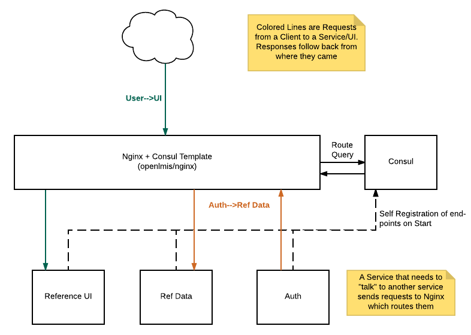

# openlmis-nginx
Provides dynamic routing and serves as an API Gateway in OpenLMIS environment.

This image is based off of the official nginx image, additionally it provides integration with [Consul](https://www.consul.io/) which serves as a Service Registry for OpenLMIS deployments. [Consul Template](https://github.com/hashicorp/consul-template) is included in this image to be able to work with an external Consul to re-configure Nginx routing based on the Service's registered there.

As Services register themselves with Consul (service registry) directly.  As these registration's occur, this container's Consul Template watches for those changes and reconfigures the routing of the bundled Nginx to match these changes.  This allows Nginx to dynamically route client HTTP requests to Service's that declare they are able to fulfill them.

All services that are tagged with `SERVICE_TAG` are defined as upstreams. Importantly, it also requires a path-service mapping in Consul's Key-Value store (more details in [Path Mapping](#path-mapping) section) to define routes.

Structural Overview:


## Path mapping
To provide proper route settings, container expects a path-service mapping to be provided. Any endpoints that are not contained within the hierarchy _will not_ be considered as exposed to API gateway. The mapping is expected to be a set of key-value pairs in Consul's Key-Value store, located in `RESOURCES_PATH` subdirectory. For each pair, the key is the (relative) path we want to expose, and the value is the name of our service, so that nginx will assign it to our service's upstream in configuration. If considered path contains a placeholder (such as ID), this should be replaced with `{param}` keyword. Param accepts any valid path that is not already defined in path mapping, but does not match subdirectories. To reserve all addresses under a given path, there is also `<all>` parameter, which will also match all parameters and subdirectories that are not taken.

### Example
For example, lets consider given structure:

users - referencedata  
users/{param} - referencedata  
users/manage - auth  
users/staff/validate - auth  
users/{param}/resetPassword - auth

This will result in following redirections:

/users - referencedata service.  
/users/manage - auth service.  
/users/... - referencedata service.  
/users/.../resetPassword - auth service.  

And importantly:  
/users/staff - referencedata service (as placeholder matches it, and it is not explicitly defined elsewhere).  
/users/staff/validate - auth service.  

## Configuration

This customized Nginx image comes with two configuration files:

1. `nginx.conf` is the standard Nginx config file.  For customizing this to
your deployment topology, simply overwrite this file by mounting your own
as a Docker volume.  e.g.

    `docker run -v /your/local/nginx.conf:/etc/nginx/nginx.conf`

1. `openlmis.conf` is the Consul-Template generated Nginx configuration which
is included in the `nginx.conf` above (if you override `nginx.conf` be sure to
include this).  This configuration should not be overridden, though it does
have a number of [environment variables](#env-variables) by which to customize Nginx behavior.

## Logging
By default, Nginx logs are stored under `/var/log/nginx` directory, and Consul Template logs can be found in `/var/log/consul-template` folder. Each of those directories is marked as VOLUME and can be mounted to, in order to retrieve logging data. Additionally, user can specify different directories for logging, using `NGINX_LOG_DIR` and `CONSUL_TEMPLATE_LOG_DIR` environment variables.

### Nginx Access Log Format

The log format used by Nginx's access is a standard access log format, with a few additional numbers and an indicator
appended.  In order:

1. request time - `Full request time, starting when NGINX reads the first byte from the client and ending when NGINX sends the last byte of the response body`
2. upstream connect time - `Time spent establishing a connection with an upstream server`
3. upstream header time - `Time between establishing a connection to an upstream server and receiving the first byte of the response header`
4. upstream response time - `Time between establishing a connection to an upstream server and receiving the last byte of the response body`
5. Pipe - if the request was piped

More details on [Nginx performance logging](https://www.nginx.com/blog/using-nginx-logging-for-application-performance-monitoring).

## Configurable environment variables:<a name="env-variables"></a>
##### `VIRTUAL_HOST`
Name of the server host. It has no default value and must be provided.

##### `CONSUL_HOST`
Server where the Consul instance is running. It defaults to `consul`.

##### `CONSUL_PORT`
Port to contact Consul's API. It defaults to `8500`.

##### `RESOURCES_PATH`
Directory in Consul's Key-Value store where the path hierarchy is located. It defaults to `resources`.

##### `SERVICE_TAG`
Consul can contain variety of services, to provide health checks, and other features. Not all of them, though, are meant to be exposed to public. This makes necessary to have a way to distinguish services that should be accessible through proxy, from the others. The `SERVICE_TAG` variable marks services as meant to be publicly accessible. Services without this tag will be ignored. OpenLMIS services automatically register themselves with this tag. This should almost always be left as-is, with it's default value of `openlmis-service`, unless some really complex configuration changes are necessary.

##### `NGINX_LOG_DIR`
The directory to store Nginx log files. It defaults to `/var/log/nginx`.

##### `CONSUL_TEMPLATE_LOG_DIR`
The directory to store Consul Template log files. It defaults to `/var/log/consul-template`.

##### `CLIENT_MAX_BODY_SIZE`
Sets the maximum allowed size of the client request body, specified in the “Content-Length” request header field. It defaults to `1m`.

##### `PROXY_CONNECT_TIMEOUT`
Defines a timeout for establishing a connection with a proxied server. It defaults to `60s`.

##### `PROXY_SEND_TIMEOUT`
Sets a timeout for transmitting a request to the proxied server. It defaults to `60s`.

##### `PROXY_READ_TIMEOUT`
Defines a timeout for reading a response from the proxied server. It defaults to `60s`.

##### `SEND_TIMEOUT`
Sets a timeout for transmitting a response to the client. It defaults to `60s`.

##### `NGINX_TIMEOUT`
If you want to set the same value for `PROXY_CONNECT_TIMEOUT`, `PROXY_SEND_TIMEOUT`, `PROXY_READ_TIMEOUT` and `SEND_TIMEOUT` you can use this variable instead.


## Volumes

Two volumes are available which may be used by an outside container to get the logging output from Nginx as well as Consul-Template.

* `/var/log/nginx` - for Nginx logs
* `/var/log/consul-template` for Consul Template

Example:

```
docker volume create --name=nginx-log
docker run -d -v nginx-log:/var/log/nginx --name nginx openlmis/nginx
docker run --rm -v nginx-log:/nginx-log openlmis/dev ls /nginx-log
```

This:

1. creates a named volume `nginx-log` that nginx will write logs to
2. runs nginx (this image) telling it to mount the named volume `nginx-log` to the nginx logging director
2. runs a throw-away container from the development image that'll mount the named volume `nginx-log` to the path `/nginx-log` and then lists the context of that directory with `ls`.  This third step is just to demonstrate the first 2 steps are working, and instead of listing the contents, one could connect to the name volume and either show the log output to the terminal or this third step could be a container that sends the log contents to an external logging service (e.g. Scalyr)
